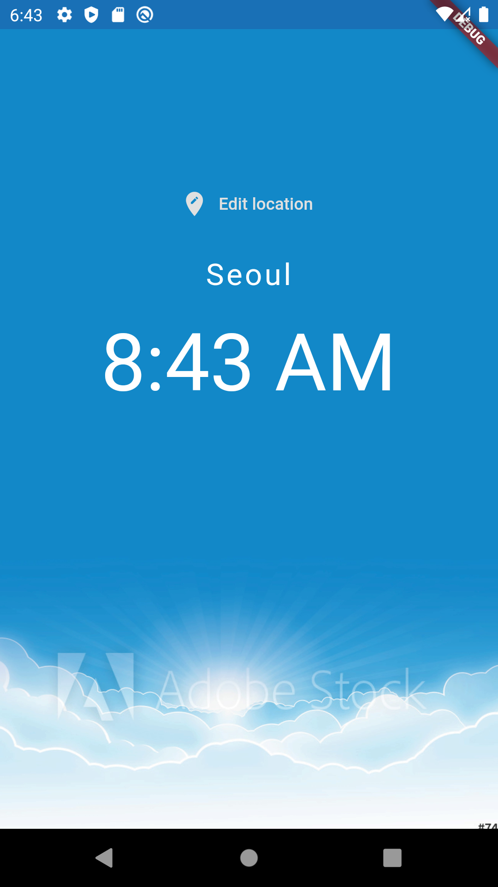
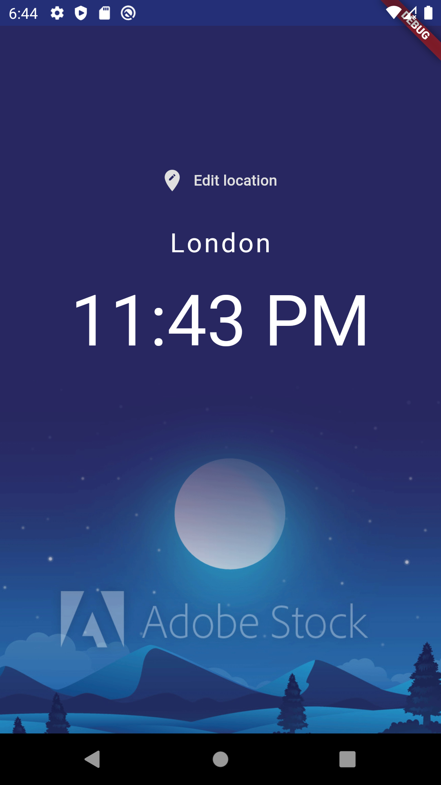
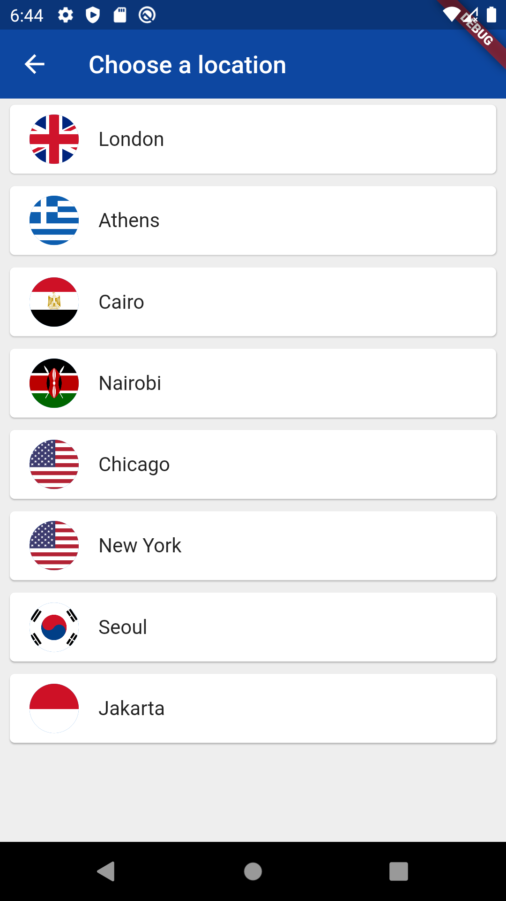

# WorldTime App
An application that says the time on different countries of a predefined list. This app also sets a background image depending on if it is day or night in the selected country.
This projects reviews a lot of Flutter basics that can be checked out via the *Commits* existing on the repository.

## Screenshots of the final app

### Note
This project is just a starting point for a Flutter application created following [this YouTube tutorials](https://www.youtube.com/playlist?list=PL4cUxeGkcC9jLYyp2Aoh6hcWuxFDX6PBJ). 
